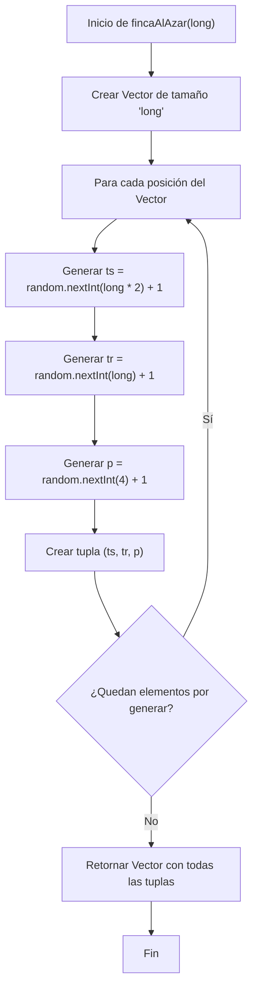
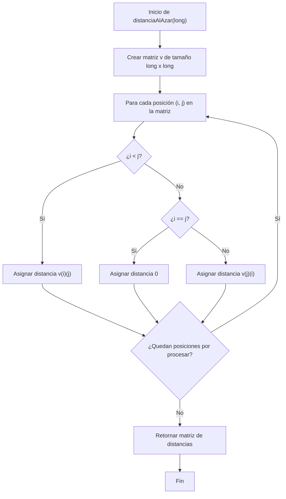
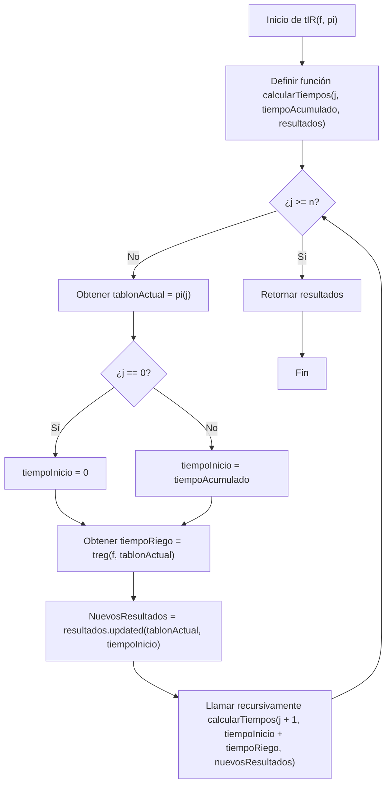
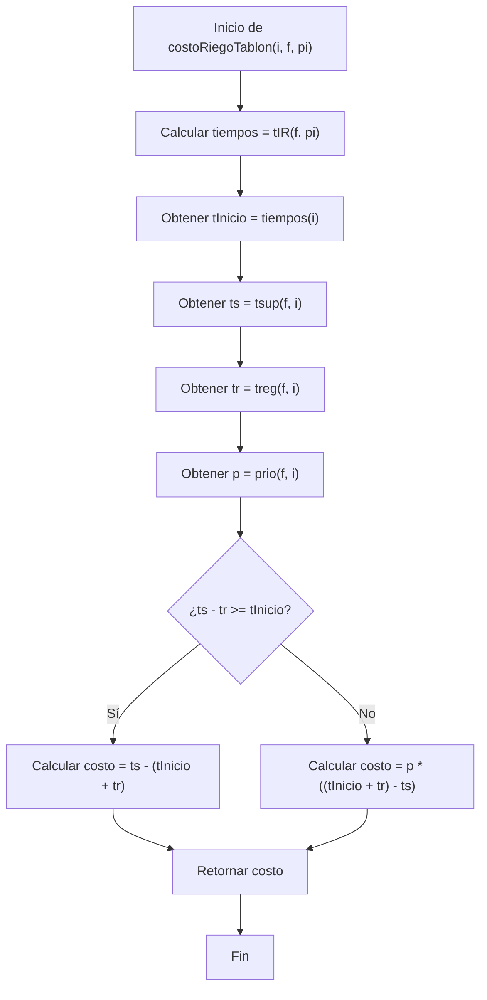
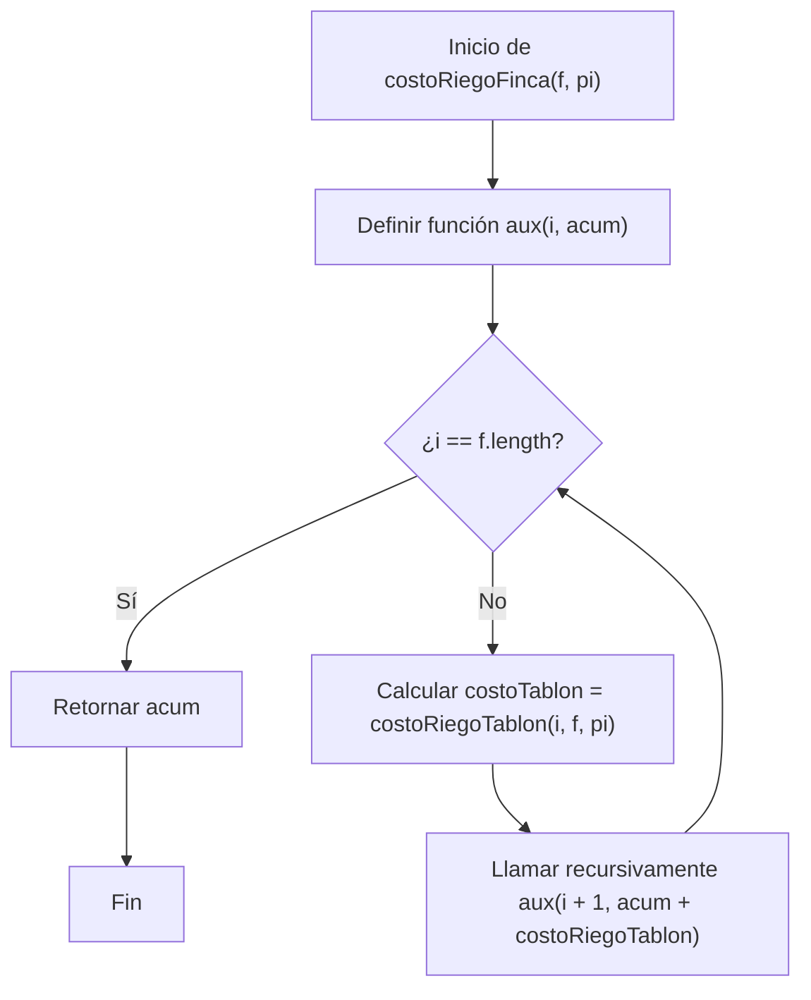
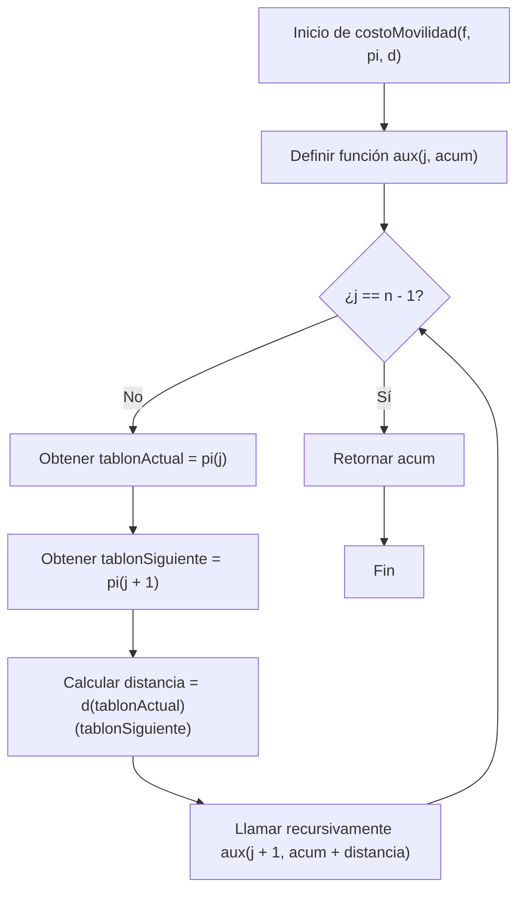
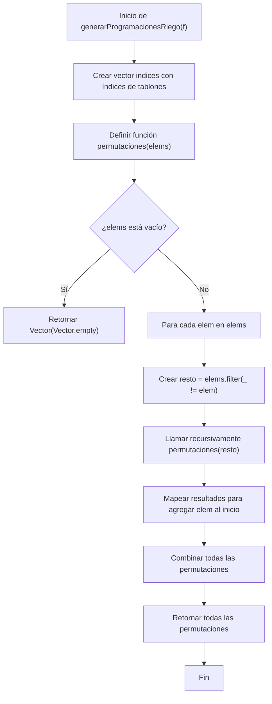
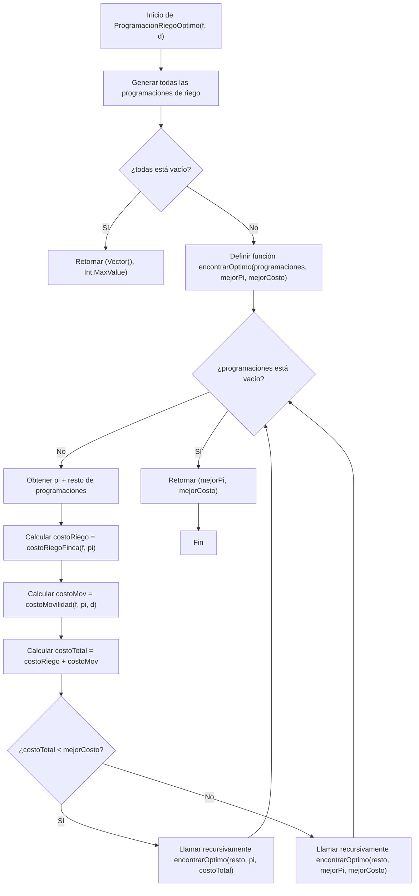

# Informe de proceso proyecto final RiegoOptimo

## 1. Definición del algoritmo
El algoritmo que se implementó en este taller es un sistema de riego eficiente en una finca usando un único sistema movil. El objetivo principal es optimizar el uso del agua para el riego de cultivos, asegurando que las plantas reciban la cantidad adecuada de agua según sus necesidades específicas.

Una finca se modela de la siguiente forma:
$$F=\langle T_{0},T_{1},…,T_{n-1} \rangle$$
donde cada tablón $T_{i}$ se define como:
$$T_{i}=\langle ts_i^F, tr_i^F, p_i^F \rangle$$
donde:
- $ts_i^F$ es el tiempo máximo que puede estar el tablón $T_{i}$ sin recibir agua.
- $tr_i^F$ es el tiempo que tarda el sistema móvil en regar el tablón $T_{i}$.
- $p_i^F$ es la prioridad del tablón $T_{i}$, que indica la urgencia de riego.

### 1.1 Programación de riego
Una programación de riego es una permutación definida como:
$$\Pi=\langle \pi_{0},\pi_{1},…,\pi_{n-1} \rangle$$
El cual indica el orden en que se regarán los tablones de la finca.

Con esta programación, podemos calcular el tiempo total de riego de cada tablón, así:
- $ t^\Pi_{\pi_{0}} = 0 $
- $ t^\Pi_{\pi_{j}} = t^\Pi_{\pi_{(j-1)}} + tr^F_{\pi_{(j-1)}}, $ para  $j=1,...,n-1$
### 1.2 Costo de riego
El costo total de riego de un tablón $T_{i}$ en una programación $\Pi$ se define como:
$$
CR_{F}^{II}[i] = \begin{cases}
ts_{i}^{F} - (t_{i}^{II} + tr_{i}^{F}), & \text{si } ts_{i}^{F} - tr_{i}^{F} \geq t_{i}^{II}, \\
p_{i}^{F} \cdot ((t_{i}^{II} + tr_{i}^{F}) - ts_{i}^{F}), & \text{de lo contrario.}
\end{cases}
$$

El costo total de riego de la finca en la programación $\Pi$ es:
$$CR^\Pi_{F} = \sum_{i=0}^{n-1} CR^\Pi_{F}[i]$$
### Costo de movilidad
El costo de movilidad para una programación $\Pi$ se define como:
$$CM^\Pi_{F} = \sum_{j=0}^{n-2} D_{F}[\pi_{j},\pi_{j+1}]$$
Donde $D_{F}[i,j]$ es la distancia entre los tablones $T_{i}$ y $T_{j}$ en la finca $F$.
Cabe aclarar que para este proyecto se asumió que:
$D_{F}[i,j] = D_{F}[j,i]$ y $D_{F}[i,i] = 0$.

Ahora, sabiendo esto, el costo total del sistema de riego en la programación $\Pi$ es:
$$CT^\Pi_{F} = CR^\Pi_{F} + CM^\Pi_{F}$$ y el objetivo del algoritmo es encontrar la programación $\Pi$ que minimice este costo total.

## 2. Proceso de desarrollo
Se diseñó el algoritmo basado en la definición matemática del problema. Se implementaron las siguientes funciones principales:
### 2.1 Definición de la estructura de datos
Se definieron los tipos de datos necesarios para representar la finca, los tablones y las programaciones de riego.
```Scala
  type Tablon = (Int, Int, Int)
  type Finca = Vector[Tablon]
  type Distancia = Vector[Vector[Int]]
  type ProgRiego = Vector[Int]
  type TiempoInicioRiego = Vector[Int]
```
### Qué representa cada tipo
- `Tablon`: Representa un tablón con su tiempo de llegada, tiempo de riego y prioridad.
- `Finca`: Representa la finca como un vector de tablones.
- `Distancia`: Representa la matriz de distancias entre los tablones.
- `ProgRiego`: Representa una programación de riego como un vector de índices de tablones.
- `TiempoInicioRiego`: Representa los tiempos de inicio de riego para cada tablón.

también se implementaron las funciones de acceso a los datos del tablón y un random para generar fincas al azar:
```Scala
  def tsup(f: Finca, i: Int): Int = f(i)._1
  def treg(f: Finca, i: Int): Int = f(i)._2
  def prio(f: Finca, i: Int): Int = f(i)._3

  val random = new Random()
```

### 2.2 Finca al azar
Se implementó una función para generar una finca aleatoria con un número dado de tablones:
```Scala
  def fincaAlAzar(long: Int): Finca = {
  Vector.fill(long) {
    (random.nextInt(long * 2) + 1,
      random.nextInt(long) + 1,
      random.nextInt(4) + 1)
  }
}
```
- **Entrada:** `long`: Número de tablones en la finca.
- **Salida:** Una finca representada como un vector de tablones con valores aleatorios para tiempo de llegada, tiempo de riego y prioridad.
### Explicación breve del código
La función `fincaAlAzar` utiliza `Vector.fill(long)` para crear un vector de tamaño `long`. Para cada posición del vector, genera una tupla que representa un tablón con valores aleatorios:
- `ts`: Tiempo máximo sin recibir agua, generado como un número aleatorio entre 1 y `long * 2`.
- `tr`: Tiempo de riego, generado como un número aleatorio entre 1 y `long`.
- `p`: Prioridad, generada como un número aleatorio entre 1 y 4.

Finalmente, la función retorna el vector completo que representa la finca con todos sus tablones.
### Ejecución paso a paso

### Prueba de validación
Se probó la función generando fincas de diferentes tamaños y verificando que los valores de los tablones estuvieran dentro de los rangos esperados.
```Scala
val finca = fincaAlAzar(5)
finca.foreach { case (ts, tr, p) =>
  assert(ts >= 1 && ts <= 10, s"ts fuera de rango: $ts")
  assert(tr >= 1 && tr <= 5, s"tr fuera de rango: $tr")
  assert(p >= 1 && p <= 4, s"p fuera de rango: $p")
}
println("Finca generada correctamente:")
finca.foreach(println)
```
### Resultado esperado
Al ejecutar la prueba, se espera que no haya errores de aserción y que se imprima una finca con 5 tablones, cada uno con valores dentro de los rangos especificados.

### Conclusión
La función `fincaAlAzar` permite generar fincas aleatorias de manera eficiente, facilitando la creación de escenarios de prueba para el algoritmo de riego óptimo.

### 2.3 Distancia al azar
Se implementó una función para generar una matriz de distancias aleatorias entre los tablones:
```Scala
  def distanciaAlAzar(long: Int): Distancia = {
  val v = Vector.fill(long, long)(random.nextInt(long * 3) + 1)
  Vector.tabulate(long, long)((i, j) =>
    if (i < j) v(i)(j)
    else if (i == j) 0
    else v(j)(i))
  }
```
- **Entrada:** `long`: Número de tablones en la finca.
- **Salida:** Una matriz de distancias representada como un vector de vectores, donde la distancia entre un tablón y sí mismo es 0, y las distancias entre diferentes tablones son simétricas y aleatorias.
### Explicación breve del código
La función `distanciaAlAzar` primero crea una matriz cuadrada `v` de tamaño `long x long`, llenándola con valores aleatorios entre 1 y `long * 3`. Luego, utiliza `Vector.tabulate` para construir la matriz final de distancias.
En esta matriz final:
- Si el índice de fila `i` es menor que el índice de columna `j`, se toma el valor directamente de `v(i)(j)`.
- Si `i` es igual a `j`, se asigna 0, ya que la distancia de un tablón a sí mismo es cero.
- Si `i` es mayor que `j`, se toma el valor de `v(j)(i)`, asegurando que la matriz sea simétrica.
### Ejecución paso a paso

### Prueba de validación
Se probó la función generando matrices de distancias de diferentes tamaños y verificando las propiedades esperadas:
```Scala
val distancia = distanciaAlAzar(5)
for (i <- distancia.indices; j <- distancia.indices) {
  if (i == j) {
    assert(distancia(i)(j) == 0, s"Distancia a sí mismo no es cero: ${distancia(i)(j)}")
  } else {
    assert(distancia(i)(j) == distancia(j)(i), s"Distancia no es simétrica: ${distancia(i)(j)} != ${distancia(j)(i)}")
    assert(distancia(i)(j) >= 1 && distancia(i)(j) <= 15, s"Distancia fuera de rango: ${distancia(i)(j)}")
    }
}
println("Matriz de distancias generada correctamente:")
distancia.foreach(row => println(row.mkString(", ")))
```
### Resultado esperado
Al ejecutar la prueba, se espera que no haya errores de aserción y que se imprima una matriz de distancias de 5x5, cumpliendo con las propiedades de simetría y valores dentro de los rangos especificados.
### Conclusión
La función `distanciaAlAzar` permite generar matrices de distancias aleatorias de manera eficiente, facilitando la creación de escenarios de prueba para el algoritmo de riego óptimo.

### 2.4 Tiempo de riego
Se implementó una función para calcular los tiempos de inicio de riego para cada tablón según una programación dada:
```Scala
  def tIR(f: Finca, pi: ProgRiego): TiempoInicioRiego = {
  val n = f.length
```
Luego, se implementó una función dentro de la anterior para calcular recursivamente todos los tiempos de riego:

```Scala
  @tailrec
  def calcularTiempos(j: Int, tiempoAcumulado: Int, resultados: Vector[Int]): Vector[Int] = {
  if (j >= n) resultados
  else {
    val tablonActual = pi(j)
    val tiempoInicio = if (j == 0) 0 else tiempoAcumulado
    val tiempoRiego = treg(f, tablonActual)
    val nuevosResultados = resultados.updated(tablonActual, tiempoInicio)
    calcularTiempos(j + 1, tiempoInicio + tiempoRiego, nuevosResultados)
  }
}

calcularTiempos(0, 0, Vector.fill(n)(0))
}
```
- **Entrada:**
    - `f`: La finca representada como un vector de tablones.
    - `pi`: La programación de riego representada como un vector de índices de tablones.
- **Salida:** Un vector que contiene los tiempos de inicio de riego para cada tablón.
### Explicación breve del código
La función `tIR` define una función interna `calcularTiempos` que utiliza recursión para calcular los tiempos de inicio de riego:
- Si el índice `j` es mayor o igual al número de tablones `n`, retorna el vector de resultados.
- Si no, obtiene el índice del tablón actual de la programación `pi`.
- Calcula el tiempo de inicio para el tablón actual. Si es el primer tablón (`j == 0`), el tiempo de inicio es 0; de lo contrario, es el tiempo acumulado hasta ese momento.
- Obtiene el tiempo de riego del tablón actual.
- Actualiza el vector de resultados con el tiempo de inicio calculado para el tablón actual.
- Llama recursivamente a `calcularTiempos` para el siguiente tablón, actualizando el tiempo acumulado sumando el tiempo de riego del tablón actual.
  Finalmente, la función `tIR` inicia la recursión con el índice 0, tiempo acumulado 0 y un vector de resultados inicializado en 0.
### Ejecución paso a paso

### Prueba de validación
Se probó la función con una finca y una programación específicas, verificando que los tiempos de
inicio de riego fueran correctos:
```Scala
val finca: Finca = Vector((2, 3, 1), (1, 2, 2), (3, 1, 3))
val progRiego: ProgRiego = Vector(0, 1, 2)
val tiemposInicio = tIR(finca, progRiego)
assert(tiemposInicio == Vector(0, 3, 5), s"Tiempos de inicio incorrectos: $tiemposInicio")
println("Tiempos de inicio de riego calculados correctamente:")
tiemposInicio.foreach(println)
```
### Resultado esperado
Al ejecutar la prueba, se espera que no haya errores de aserción y que se imprima el vector de tiempos de inicio de riego como `Vector(0, 3, 5)`.
### Conclusión
La función `tIR` permite calcular de manera eficiente los tiempos de inicio de riego para cada tablón según una programación dada, facilitando la evaluación del costo de riego en el algoritmo de riego óptimo.
### 2.5 Funciones de costo de riego
### 2.5.1 Costo de riego por tablón
Se implementó una función para calcular el costo de riego de un tablón específico en una programación dada:
```Scala 
def costoRiegoTablon(i: Int, f: Finca, pi: ProgRiego): Int = {
    val tiempos = tIR(f, pi)
    val tInicio = tiempos(i)
    val ts = tsup(f, i)
    val tr = treg(f, i)
    val p = prio(f, i)

    if (ts - tr >= tInicio) ts - (tInicio + tr)
    else p * ((tInicio + tr) - ts)
  }
```
- **Entrada:**
    - `i`: Índice del tablón para el cual se calcula el costo de riego.
    - `f`: La finca representada como un vector de tablones.
    - `pi`: La programación de riego representada como un vector de índices de tablones.
- **Salida:** El costo de riego del tablón `i` en la programación `pi`.
### Explicación breve del código
La función `costoRiegoTablon` primero calcula los tiempos de inicio de riego para todos los tablones utilizando la función `tIR`. Luego, obtiene el tiempo de inicio de riego para el tablón `i`, así como sus parámetros `ts`, `tr` y `p`.
A continuación, aplica la fórmula del costo de riego:
- Si el tiempo máximo que puede estar el tablón sin recibir agua `ts` menos el tiempo de riego `tr` es mayor o igual al tiempo de inicio `tInicio`, el costo es la diferencia entre `ts` y la suma de `tInicio` y `tr`.
- De lo contrario, el costo es la prioridad `p` multiplicada por la diferencia entre la suma de `tInicio` y `tr` y `ts`.
  Finalmente, la función retorna el costo calculado para el tablón `i`.
### Ejecución paso a paso

### 2.5.2 Costo total riego finca
Se implementó una función para calcular el costo total de riego de la finca en una programación dada:

```Scala
  def costoRiegoFinca(f: Finca, pi: ProgRiego): Int = {
  @tailrec
  def aux(i: Int, acum: Int): Int = {
    if (i == f.length) acum
    else aux(i + 1, acum + costoRiegoTablon(i, f, pi))
  }

  aux(0, 0)
}
```
- **Entrada:**
    - `f`: La finca representada como un vector de tablones.
    - `pi`: La programación de riego representada como un vector de índices de tablones.
- **Salida:** El costo total de riego de la finca en la programación `pi`.
### Explicación breve del código
La función `costoRiegoFinca` define una función interna `aux` que utiliza recursión de cola para calcular el costo total de riego:
- Si el índice `i` es igual a la longitud de la finca `f`, retorna el acumulador `acum`, que contiene el costo total calculado hasta ese momento.
- Si no, llama recursivamente a `aux`, incrementando el índice `i` en 1 y sumando al acumulador el costo de riego del tablón `i`, calculado mediante la función `costoRiegoTablon`.
Finalmente, la función `costoRiegoFinca` inicia la recursión con el índice 0 y un acumulador inicial de 0.
### Ejecución paso a paso

### Prueba de validación
Se probó la función con una finca y una programación específicas, verificando que el costo total de riego fuera correcto:
```Scala
val finca: Finca = Vector((5, 2, 1), (4, 1, 3), (8, 3, 2))
val progRiego: ProgRiego = Vector(0, 1, 2)
val costoTotal = costoRiegoFinca(finca, progRiego)
assert(costoTotal == 6, s"Costo total de riego incorrecto: $costoTotal")
println("Costo total de riego calculado correctamente:")
println(costoTotal)
```
### Resultado esperado
Al ejecutar la prueba, se espera que no haya errores de aserción y que se imprima el costo total de riego como `6`.
### Conclusión
La función `costoRiegoFinca` permite calcular de manera eficiente el costo total de riego de la finca en una programación dada, facilitando la evaluación del desempeño del algoritmo de riego óptimo.
### 2.6 Costo de movilidad
Se implementó una función para calcular el costo de movilidad en una programación dada:

```Scala
def costoMovilidad(f: Finca, pi: ProgRiego, d: Distancia): Int = {
  val n = pi.length

  @tailrec
  def aux(j: Int, acum: Int): Int = {
    if (j == n - 1) acum
    else {
      val tablonActual = pi(j)
      val tablonSiguiente = pi(j + 1)
      aux(j + 1, acum + d(tablonActual)(tablonSiguiente))
    }
  }

  if (n <= 1) 0 else aux(0, 0)
}
```
- **Entrada:**
    - `f`: La finca representada como un vector de tablones.
    - `pi`: La programación de riego representada como un vector de índices de tablones.
    - `d`: La matriz de distancias entre los tablones.
- **Salida:** El costo de movilidad en la programación `pi`.
### Explicación breve del código
La función `costoMovilidad` define una función interna `aux` que utiliza recursión de cola para calcular el costo de movilidad:
- Si el índice `j` es igual a `n - 1`, donde `n` es la longitud de la programación `pi`, retorna el acumulador `acum`, que contiene el costo de movilidad calculado hasta ese momento.
- Si no, obtiene los índices del tablón actual y el siguiente de la programación `pi`, y llama recursivamente a `aux`, incrementando el índice `j` en 1 y sumando al acumulador la distancia entre el tablón actual y el siguiente, obtenida de la matriz `d`.
Finalmente, la función `costoMovilidad` verifica si la longitud de la programación `n` es menor o igual a 1; en ese caso, retorna 0, ya que no hay movilidad necesaria. De lo contrario, inicia la recursión con el índice 0 y un acumulador inicial de 0.
### Ejecución paso a paso

### Prueba de validación
Se probó la función con una finca, una programación y una matriz de distancias específicas, verificando que el costo de movilidad fuera correcto:
```Scala
val finca: Finca = Vector((2, 3, 1), (1, 2, 2), (3, 1, 3))
val progRiego: ProgRiego = Vector(0, 1, 2)
val distancia: Distancia = Vector(
  Vector(0, 5, 10),
  Vector(5, 0, 3),
  Vector(10, 3, 0)
)
val costoMov = costoMovilidad(finca, progRiego, distancia)
assert(costoMov == 8, s"Costo de movilidad incorrecto: $costoMov")
println("Costo de movilidad calculado correctamente:")
println(costoMov)
```
### Resultado esperado
Al ejecutar la prueba, se espera que no haya errores de aserción y que se imprima el costo de movilidad como `8`.
### Conclusión
La función `costoMovilidad` permite calcular de manera eficiente el costo de movilidad en una programación dada, facilitando la evaluación del desempeño del algoritmo de riego óptimo.
### 2.7 Generar programaciones de riego
Se implementó una función para generar todas las permutaciones posibles de programaciones de riego:
```Scala
def generarProgramacionesRiego(f: Finca): Vector[ProgRiego] = {
  val indices = (0 until f.length).toVector

  def permutaciones(elems: Vector[Int]): Vector[Vector[Int]] = {
    if (elems.isEmpty) Vector(Vector.empty)
    else {
      elems.flatMap { elem =>
        val resto = elems.filter(_ != elem)
        permutaciones(resto).map(elem +: _)
      }
    }
  }

  permutaciones(indices)
}
```
- **Entrada:** `f`: La finca representada como un vector de tablones.
- **Salida:** Un vector que contiene todas las permutaciones posibles de programaciones de riego.
### Explicación breve del código
La función `generarProgramacionesRiego` primero crea un vector `indices` que contiene los índices de los tablones en la finca. Luego, define una función interna `permutaciones` que genera todas las permutaciones posibles de un vector dado:
- Si el vector `elems` está vacío, retorna un vector que contiene un vector vacío.
- Si no, utiliza `flatMap` para iterar sobre cada elemento `elem` en `elems`. Para cada elemento, crea un nuevo vector `resto` que contiene todos los elementos excepto `elem`. Luego, llama recursivamente a `permutaciones` con `resto` y mapea los resultados para agregar `elem` al inicio de cada permutación generada.
Finalmente, la función `generarProgramacionesRiego` llama a `permutaciones` con el vector de índices y retorna todas las permutaciones generadas.
### Ejecución paso a paso

### Prueba de validación
Se probó la función con una finca específica, verificando que todas las permutaciones fueran correctas:
```Scala
val finca: Finca = Vector((2, 3, 1), (1, 2, 2), (3, 1, 3))
val programaciones = generarProgramacionesRiego(finca)
val expectedProgramaciones = Vector(
  Vector(0, 1, 2),
  Vector(0, 2, 1),
  Vector(1, 0, 2),
  Vector(1, 2, 0),
  Vector(2, 0, 1),
  Vector(2, 1, 0)
)
assert(programaciones == expectedProgramaciones, s"Programaciones incorrectas: $programaciones")
println("Programaciones de riego generadas correctamente:")
programaciones.foreach(println)
```
### Resultado esperado
Al ejecutar la prueba, se espera que no haya errores de aserción y que se impriman todas las permutaciones de programaciones de riego como se esperaba.
### Conclusión
La función `generarProgramacionesRiego` permite generar de manera eficiente todas las permutaciones posibles de programaciones de riego, facilitando la evaluación exhaustiva del algoritmo de riego óptimo.

### 2.8 Programación de riego óptimo
Se implementó una función para encontrar la programación de riego que minimiza el costo total:
```Scala
def ProgramacionRiegoOptimo(f: Finca, d: Distancia): (ProgRiego, Int) = {
    val todas = generarProgramacionesRiego(f)

    if (todas.isEmpty) (Vector(), Int.MaxValue)
    else {
      def encontrarOptimo(programaciones: Vector[ProgRiego], mejorPi: ProgRiego, mejorCosto: Int): (ProgRiego, Int) = {
        programaciones match {
          case Vector() => (mejorPi, mejorCosto)
          case pi +: resto =>
            val costoRiego = costoRiegoFinca(f, pi)
            val costoMov = costoMovilidad(f, pi, d)
            val costoTotal = costoRiego + costoMov

            if (costoTotal < mejorCosto) encontrarOptimo(resto, pi, costoTotal)
            else encontrarOptimo(resto, mejorPi, mejorCosto)
        }
      }

      val primeraPi = todas.head
      val primerCosto = costoRiegoFinca(f, primeraPi) + costoMovilidad(f, primeraPi, d)
      encontrarOptimo(todas.tail, primeraPi, primerCosto)
    }
  }
```
- **Entrada:**
    - `f`: La finca representada como un vector de tablones.
    - `d`: La matriz de distancias entre los tablones.
- **Salida:** Una tupla que contiene la programación de riego óptima y su costo total.
### Explicación breve del código
La función `ProgramacionRiegoOptimo` primero genera todas las programaciones de riego posibles utilizando la función `generarProgramacionesRiego`. Si no hay programaciones, retorna una tupla con un vector vacío y el valor máximo de entero.
Luego, define una función interna `encontrarOptimo` que utiliza coincidencia de patrones para iterar sobre las programaciones:
- Si el vector de programaciones está vacío, retorna la mejor programación y su costo.
- Si no, toma la primera programación `pi` y calcula su costo de riego y costo de movilidad. Suma ambos costos para obtener el costo total.
  - Compara el costo total con el mejor costo encontrado hasta ahora. Si es menor, llama recursivamente a `encontrarOptimo` con el resto de las programaciones, actualizando la mejor programación y costo. Si no, continúa con la mejor programación y costo actuales.
  Finalmente, la función `ProgramacionRiegoOptimo` inicia la búsqueda del óptimo con la primera programación y su costo calculado.
### Ejecución paso a paso

### Prueba de validación
Se probó la función con una finca y una matriz de distancias específicas, verificando que la programación óptima y su costo fueran correctos:
```Scala
val finca: Finca = Vector((5, 2, 1), (4, 1, 3), (8, 3, 2))
val distancia: Distancia = Vector(
  Vector(0, 5, 10),
  Vector(5, 0, 3),
  Vector(10, 3, 0)
)
val (progOptima, costoOptimo) = ProgramacionRiegoOptimo(finca, distancia)
assert(progOptima == Vector(1, 0, 2), s"Programación óptima incorrecta: $progOptima")
val todas = generarProgramacionesRiego(finca)
val costos = todas.map(pi => costoRiegoFinca(finca, pi) + costoMovilidad(finca, pi, distancia))

assert(costoOptimo == costos.min,
  s"El costo óptimo devuelto ($costoOptimo) no coincide con el mínimo real (${costos.min})")

val mejoresProgramaciones = todas.zip(costos).filter(_._2 == costos.min).map(_._1)
assert(mejoresProgramaciones.contains(progOptima),
  s"La programación devuelta $progOptima no es una de las óptimas: $mejoresProgramaciones")

println("Programación óptima validada correctamente.")
println(s"Mejor programación encontrada: $progOptima con costo $costoOptimo")
```
### Resultado esperado
Al ejecutar la prueba. La función debe devolver una programación cuya suma de `costoRiegoFinca + costoMovilidad` sea igual al costo mínimo obtenido entre todas las permutaciones posibles.
### Conclusión
La función `ProgramacionRiegoOptimo` permite encontrar de manera eficiente la programación de riego que minimiza el costo total, facilitando la optimización del sistema de riego en la finca.

## 3. Relación entre las funciones
Las funciones implementadas están interrelacionadas de la siguiente manera:
- `fincaAlAzar` y `distanciaAlAzar` generan de manera aleatoria los datos de entrada necesarios para el algoritmo.
- `tIR` calcula los tiempos de inicio de riego, que son utilizados por `costoRiegoTablon` para calcular el costo de riego por tablón.
- `costoRiegoFinca` utiliza `costoRiegoTablon` para calcular el costo total de riego de la finca.
- `costoMovilidad` calcula el costo de movilidad basado en la programación de riego.
- `generarProgramacionesRiego` genera todas las posibles programaciones de riego.
- `ProgramacionRiegoOptimo` utiliza todas las funciones anteriores para encontrar la programación de riego que minimiza el costo total.
## 4. Conclusión
El desarrollo del algoritmo de riego óptimo involucró la implementación de varias funciones interrelacionadas. Cada función fue diseñada para cumplir un propósito específico, desde la generación de datos hasta el cálculo de costos y la búsqueda de la mejor programación.

Se realizaron pruebas de validación para asegurar la correcta funcionalidad de cada componente, y se logró una solución integral que optimiza el sistema de riego en la finca. Este enfoque modular facilita futuras mejoras y adaptaciones del algoritmo según las necesidades específicas del problema.

